# Sequence Diagrams

> Mermaid sequence diagrams for the most important workflows in the system. Renders in any Markdown viewer that supports Mermaid (GitHub, VS Code with the Markdown Preview Mermaid Support extension).
>
> If a flow isn't here, it's either trivial (basic CRUD) or hasn't been designed yet (TODO marker).

---

## Index

1. [The 6-step workflow (the marketed one)](#1-the-6-step-workflow-the-marketed-one)
2. [Tenant onboarding (Clerk → our DB)](#2-tenant-onboarding-clerk--our-db)
3. [Authenticated request lifecycle (RLS context setting)](#3-authenticated-request-lifecycle-rls-context-setting)
4. [Branded intake → AI assessment](#4-branded-intake--ai-assessment)
5. [Document upload pipeline](#5-document-upload-pipeline)
6. [AI assessment re-run on doc upload](#6-ai-assessment-re-run-on-doc-upload)
7. [Support letter draft → attorney approval](#7-support-letter-draft--attorney-approval)
8. [Legal research memo with citation safety](#8-legal-research-memo-with-citation-safety)
9. [Forms engine: I-140 auto-fill](#9-forms-engine-i-140-auto-fill)
10. [Filing packet assembly](#10-filing-packet-assembly)
11. [Brenda agent tick (autonomous nudge loop)](#11-brenda-agent-tick-autonomous-nudge-loop)
12. [Outbound email approval gate](#12-outbound-email-approval-gate)
13. [Stripe payment → trust ledger](#13-stripe-payment--trust-ledger)
14. [DocuSign envelope → contract signed](#14-docusign-envelope--contract-signed)
15. [Postmark inbound email → case thread](#15-postmark-inbound-email--case-thread)
16. [USCIS receipt poll cron](#16-uscis-receipt-poll-cron)
17. [Visa Bulletin daily scrape](#17-visa-bulletin-daily-scrape)
18. [RFE notice upload → deadline auto-creation](#18-rfe-notice-upload--deadline-auto-creation)
19. [Cross-tenant isolation test (CI)](#19-cross-tenant-isolation-test-ci)
20. [Right-to-erasure](#20-right-to-erasure)

---

## 1. The 6-step workflow (the marketed one)

The flow Ponte sells. Goes from a candidate clicking the intake link to an attorney opening a fully-prepped file.

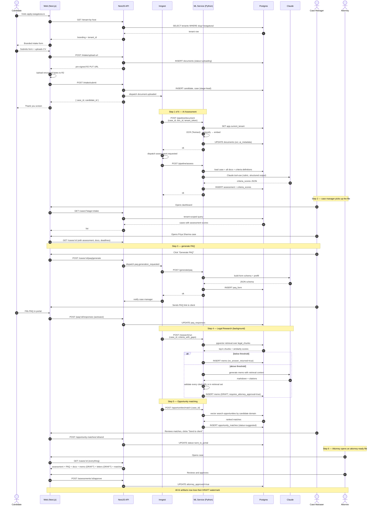
```mermaid
sequenceDiagram
    autonumber
    actor C as Candidate
    participant W as Web (Next.js)
    participant API as NestJS API
    participant ING as Inngest
    participant ML as ML Service (Python)
    participant DB as Postgres
    participant LLM as Claude
    actor CM as Case Manager
    actor ATY as Attorney

    C->>W: Visits apply.swagatusa.io
    W->>API: GET /tenant-by-host
    API->>DB: SELECT tenants WHERE slug='swagatusa'
    DB-->>API: tenant row
    API-->>W: branding + tenant_id
    W-->>C: Branded intake form

    C->>W: Submits form + uploads CV
    W->>API: POST /intake/upload-url
    API->>DB: INSERT documents (status=uploading)
    API-->>W: pre-signed R2 PUT URL
    W->>W: Upload encrypted bytes to R2
    W->>API: POST /intake/submit
    API->>DB: INSERT candidate, case (stage=lead)
    API->>ING: dispatch document.uploaded
    API-->>W: { case_id, candidate_id }
    W-->>C: Thank you screen

    Note over ING,ML: Step 1 of 6 — AI Assessment
    ING->>ML: POST /pipeline/document<br/>(case_id, doc_id, tenant_token)
    ML->>DB: SET app.current_tenant
    ML->>ML: OCR (Textract) → classify → embed
    ML->>DB: UPDATE documents (ocr, ai_metadata)
    ML-->>ING: ok
    ING->>ING: dispatch assessment.requested

    ING->>ML: POST /pipeline/assess
    ML->>DB: load case + all docs + criteria definitions
    ML->>LLM: Claude tool-use (rubric, structured output)
    LLM-->>ML: criteria_scores JSON
    ML->>DB: INSERT assessment + criteria_scores
    ML-->>ING: ok

    Note over CM,ATY: Step 2 — case manager picks up the file
    CM->>W: Opens dashboard
    W->>API: GET /cases?stage=intake
    API->>DB: tenant-scoped query
    DB-->>API: cases with assessment scores
    API-->>W: list
    CM->>W: Opens Priya Sharma case
    W->>API: GET /cases/:id (with assessment, docs, deadlines)

    Note over CM,W: Step 3 — generate PAQ
    CM->>W: Click "Generate PAQ"
    W->>API: POST /cases/:id/paq/generate
    API->>ING: dispatch paq.generation_requested
    ING->>ML: POST /generate/paq
    ML->>LLM: build form schema + prefill
    LLM-->>ML: JSON schema
    ML->>DB: INSERT paq_form
    ML-->>ING: ok
    ING->>API: notify case manager
    CM->>W: Sends PAQ link to client
    C->>W: Fills PAQ in portal
    W->>API: POST /paq/:id/responses (autosave)
    API->>DB: UPDATE paq_responses

    Note over ING,LLM: Step 4 — Legal Research (background)
    ING->>ML: POST /research/run<br/>(case_id, criteria_with_gaps)
    ML->>DB: pgvector retrieval over legal_chunks
    DB-->>ML: top-k chunks + similarity scores
    alt below threshold
        ML->>DB: INSERT memo (no_answer_returned=true)
    else above threshold
        ML->>LLM: generate memo with retrieval context
        LLM-->>ML: markdown + citations
        ML->>ML: validate every cited URL is in retrieval set
        ML->>DB: INSERT memo (DRAFT, requires_attorney_approval=true)
    end

    Note over ING,ML: Step 5 — Opportunity matching
    ING->>ML: POST /opportunities/match (case_id)
    ML->>DB: vector search opportunities by candidate domain
    DB-->>ML: ranked matches
    ML->>DB: INSERT opportunity_matches (status=suggested)
    CM->>W: Reviews matches, clicks "Send to client"
    W->>API: POST /opportunity-matches/:id/send
    API->>DB: UPDATE status=sent_to_portal

    Note over ATY: Step 6 — Attorney opens an attorney-ready file
    ATY->>W: Opens case
    W->>API: GET /cases/:id (everything)
    API-->>W: assessment + PAQ + docs + memo (DRAFT) + letters (DRAFT) + matches
    ATY->>W: Reviews and approves
    W->>API: POST /assessments/:id/approve
    API->>DB: UPDATE attorney_approved=true
    Note over ATY,W: All AI artifacts now lose their DRAFT watermark
```

---

## 2. Tenant onboarding (Clerk → our DB)

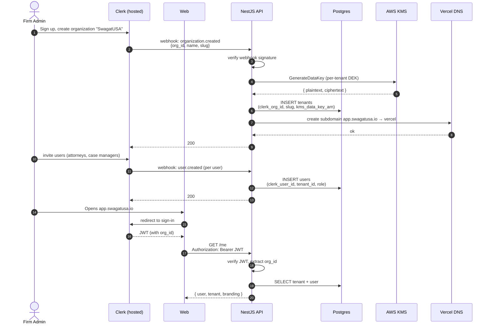
```mermaid
sequenceDiagram
    autonumber
    actor FA as Firm Admin
    participant CLK as Clerk (hosted)
    participant W as Web
    participant API as NestJS API
    participant DB as Postgres
    participant KMS as AWS KMS
    participant VRC as Vercel DNS

    FA->>CLK: Sign up, create organization "SwagatUSA"
    CLK->>API: webhook: organization.created<br/>{org_id, name, slug}
    API->>API: verify webhook signature
    API->>KMS: GenerateDataKey (per-tenant DEK)
    KMS-->>API: { plaintext, ciphertext }
    API->>DB: INSERT tenants<br/>(clerk_org_id, slug, kms_data_key_arn)
    API->>VRC: create subdomain app.swagatusa.io → vercel
    VRC-->>API: ok
    API-->>CLK: 200

    FA->>CLK: invite users (attorneys, case managers)
    CLK->>API: webhook: user.created (per user)
    API->>DB: INSERT users<br/>(clerk_user_id, tenant_id, role)
    API-->>CLK: 200

    FA->>W: Opens app.swagatusa.io
    W->>CLK: redirect to sign-in
    CLK-->>W: JWT (with org_id)
    W->>API: GET /me<br/>Authorization: Bearer JWT
    API->>API: verify JWT, extract org_id
    API->>DB: SELECT tenant + user
    API-->>W: { user, tenant, branding }
```

---

## 3. Authenticated request lifecycle (RLS context setting)

The sacred path. Every request must traverse it.

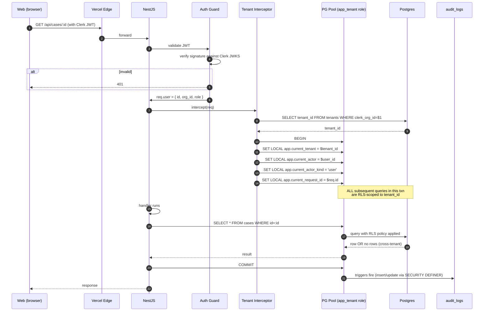
```mermaid
sequenceDiagram
    autonumber
    participant W as Web (browser)
    participant CDN as Vercel Edge
    participant API as NestJS
    participant Guard as Auth Guard
    participant Inter as Tenant Interceptor
    participant Pool as PG Pool (app_tenant role)
    participant DB as Postgres
    participant Audit as audit_logs

    W->>CDN: GET /api/cases/:id (with Clerk JWT)
    CDN->>API: forward
    API->>Guard: validate JWT
    Guard->>Guard: verify signature against Clerk JWKS
    alt invalid
        Guard-->>W: 401
    end
    Guard->>API: req.user = { id, org_id, role }

    API->>Inter: intercept(req)
    Inter->>DB: SELECT tenant_id FROM tenants WHERE clerk_org_id=$1
    DB-->>Inter: tenant_id
    Inter->>Pool: BEGIN
    Inter->>Pool: SET LOCAL app.current_tenant = $tenant_id
    Inter->>Pool: SET LOCAL app.current_actor = $user_id
    Inter->>Pool: SET LOCAL app.current_actor_kind = 'user'
    Inter->>Pool: SET LOCAL app.current_request_id = $req.id
    Note over Pool,DB: ALL subsequent queries in this txn<br/>are RLS-scoped to tenant_id

    API->>API: handler runs
    API->>Pool: SELECT * FROM cases WHERE id=:id
    Pool->>DB: query with RLS policy applied
    DB-->>Pool: row OR no rows (cross-tenant)
    Pool-->>API: result

    API->>Pool: COMMIT
    Pool->>Audit: triggers fire (insert/update via SECURITY DEFINER)
    API-->>W: response
```

If the interceptor fails to set the tenant context (e.g. user has no org), the transaction never starts and the request fails 403. RLS doesn't even get a chance to leak.

---

## 4. Branded intake → AI assessment

A trimmed version of flow #1, focused on the public path.

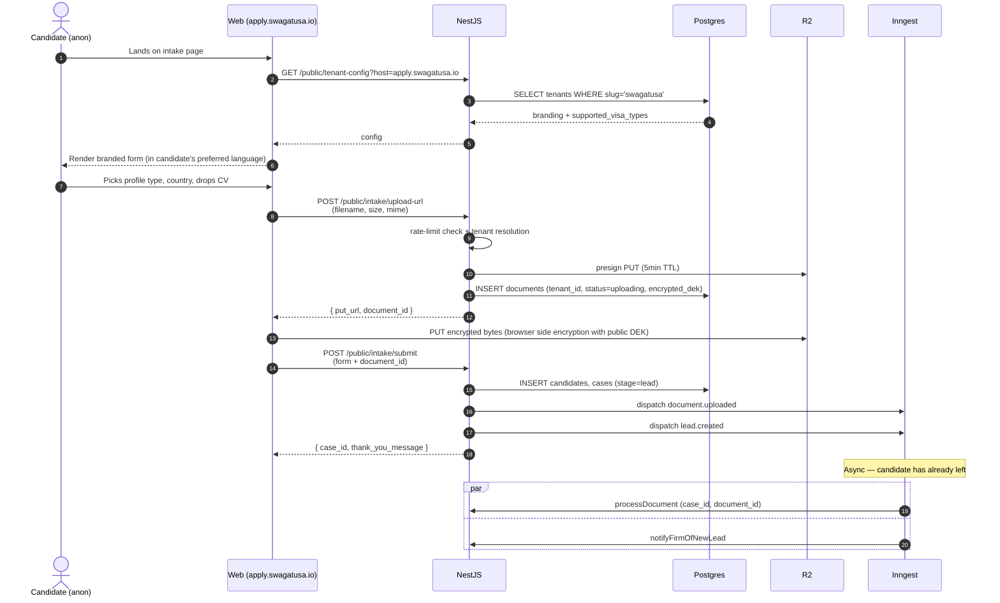
```mermaid
sequenceDiagram
    autonumber
    actor C as Candidate (anon)
    participant W as Web (apply.swagatusa.io)
    participant API as NestJS
    participant DB as Postgres
    participant R2 as R2
    participant ING as Inngest

    C->>W: Lands on intake page
    W->>API: GET /public/tenant-config?host=apply.swagatusa.io
    API->>DB: SELECT tenants WHERE slug='swagatusa'
    DB-->>API: branding + supported_visa_types
    API-->>W: config
    W-->>C: Render branded form (in candidate's preferred language)

    C->>W: Picks profile type, country, drops CV
    W->>API: POST /public/intake/upload-url<br/>(filename, size, mime)
    API->>API: rate-limit check + tenant resolution
    API->>R2: presign PUT (5min TTL)
    API->>DB: INSERT documents (tenant_id, status=uploading, encrypted_dek)
    API-->>W: { put_url, document_id }

    W->>R2: PUT encrypted bytes (browser side encryption with public DEK)
    W->>API: POST /public/intake/submit<br/>(form + document_id)
    API->>DB: INSERT candidates, cases (stage=lead)
    API->>ING: dispatch document.uploaded
    API->>ING: dispatch lead.created
    API-->>W: { case_id, thank_you_message }

    Note over ING: Async — candidate has already left
    par
        ING->>API: processDocument (case_id, document_id)
    and
        ING->>API: notifyFirmOfNewLead
    end
```

---

## 5. Document upload pipeline

What happens to a document between hitting R2 and being usable for assessment.

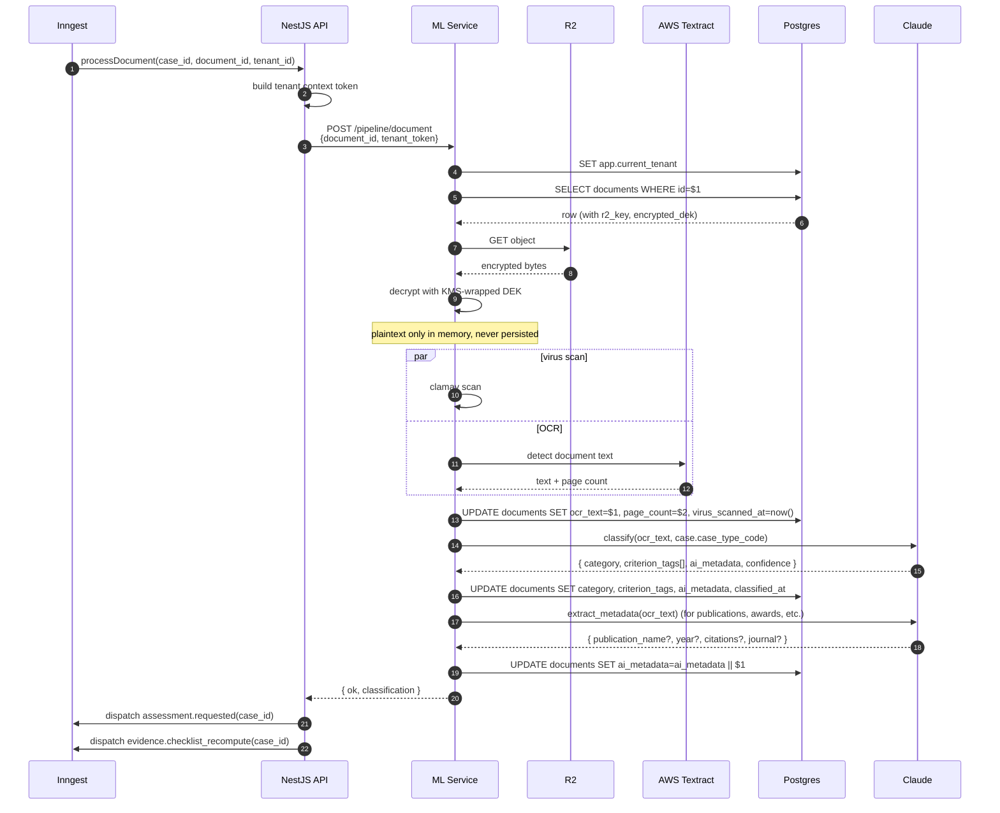
```mermaid
sequenceDiagram
    autonumber
    participant ING as Inngest
    participant API as NestJS API
    participant ML as ML Service
    participant R2 as R2
    participant TXT as AWS Textract
    participant DB as Postgres
    participant LLM as Claude

    ING->>API: processDocument(case_id, document_id, tenant_id)
    API->>API: build tenant context token
    API->>ML: POST /pipeline/document<br/>{document_id, tenant_token}

    ML->>DB: SET app.current_tenant
    ML->>DB: SELECT documents WHERE id=$1
    DB-->>ML: row (with r2_key, encrypted_dek)

    ML->>R2: GET object
    R2-->>ML: encrypted bytes
    ML->>ML: decrypt with KMS-wrapped DEK
    Note over ML: plaintext only in memory, never persisted

    par virus scan
        ML->>ML: clamav scan
    and OCR
        ML->>TXT: detect document text
        TXT-->>ML: text + page count
    end
    ML->>DB: UPDATE documents SET ocr_text=$1, page_count=$2, virus_scanned_at=now()

    ML->>LLM: classify(ocr_text, case.case_type_code)
    LLM-->>ML: { category, criterion_tags[], ai_metadata, confidence }
    ML->>DB: UPDATE documents SET category, criterion_tags, ai_metadata, classified_at

    ML->>LLM: extract_metadata(ocr_text) (for publications, awards, etc.)
    LLM-->>ML: { publication_name?, year?, citations?, journal? }
    ML->>DB: UPDATE documents SET ai_metadata=ai_metadata || $1

    ML-->>API: { ok, classification }
    API->>ING: dispatch assessment.requested(case_id)
    API->>ING: dispatch evidence.checklist_recompute(case_id)
```

---

## 6. AI assessment re-run on doc upload

Cached by `(case_id, layer, doc_set_hash, model_version)`.

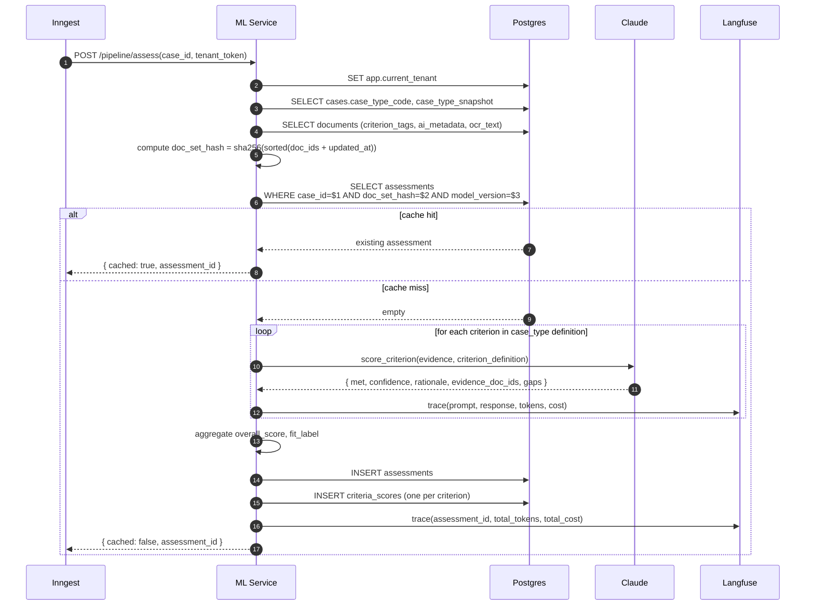
```mermaid
sequenceDiagram
    autonumber
    participant ING as Inngest
    participant ML as ML Service
    participant DB as Postgres
    participant LLM as Claude
    participant LF as Langfuse

    ING->>ML: POST /pipeline/assess(case_id, tenant_token)
    ML->>DB: SET app.current_tenant
    ML->>DB: SELECT cases.case_type_code, case_type_snapshot
    ML->>DB: SELECT documents (criterion_tags, ai_metadata, ocr_text)
    ML->>ML: compute doc_set_hash = sha256(sorted(doc_ids + updated_at))

    ML->>DB: SELECT assessments<br/>WHERE case_id=$1 AND doc_set_hash=$2 AND model_version=$3
    alt cache hit
        DB-->>ML: existing assessment
        ML-->>ING: { cached: true, assessment_id }
    else cache miss
        DB-->>ML: empty
        loop for each criterion in case_type definition
            ML->>LLM: score_criterion(evidence, criterion_definition)
            LLM-->>ML: { met, confidence, rationale, evidence_doc_ids, gaps }
            ML->>LF: trace(prompt, response, tokens, cost)
        end
        ML->>ML: aggregate overall_score, fit_label
        ML->>DB: INSERT assessments
        ML->>DB: INSERT criteria_scores (one per criterion)
        ML->>LF: trace(assessment_id, total_tokens, total_cost)
        ML-->>ING: { cached: false, assessment_id }
    end
```

---

## 7. Support letter draft → attorney approval

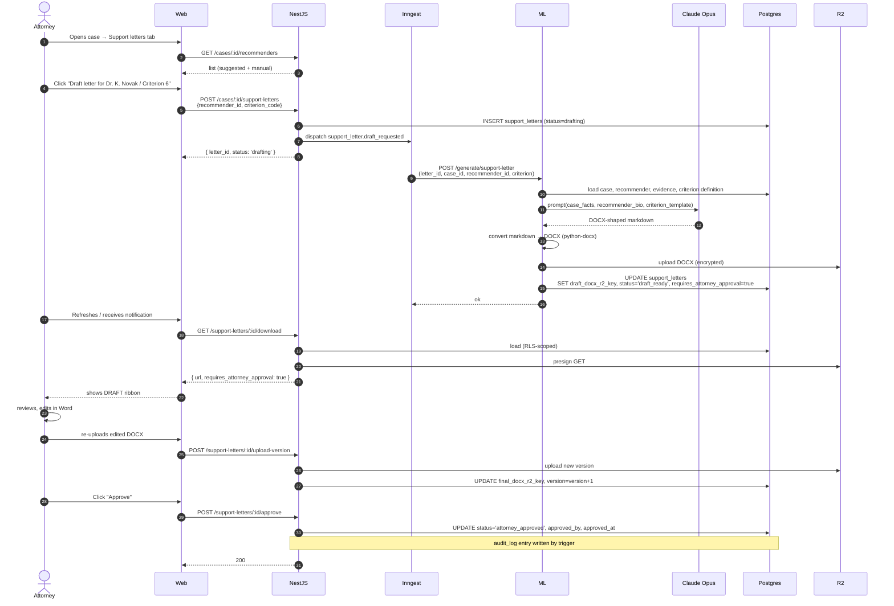
```mermaid
sequenceDiagram
    autonumber
    actor ATY as Attorney
    participant W as Web
    participant API as NestJS
    participant ING as Inngest
    participant ML as ML
    participant LLM as Claude Opus
    participant DB as Postgres

    ATY->>W: Opens case → Support letters tab
    W->>API: GET /cases/:id/recommenders
    API-->>W: list (suggested + manual)

    ATY->>W: Click "Draft letter for Dr. K. Novak / Criterion 6"
    W->>API: POST /cases/:id/support-letters<br/>{recommender_id, criterion_code}
    API->>DB: INSERT support_letters (status=drafting)
    API->>ING: dispatch support_letter.draft_requested
    API-->>W: { letter_id, status: 'drafting' }

    ING->>ML: POST /generate/support-letter<br/>(letter_id, case_id, recommender_id, criterion)
    ML->>DB: load case, recommender, evidence, criterion definition
    ML->>LLM: prompt(case_facts, recommender_bio, criterion_template)
    LLM-->>ML: DOCX-shaped markdown
    ML->>ML: convert markdown → DOCX (python-docx)
    ML->>R2: upload DOCX (encrypted)
    ML->>DB: UPDATE support_letters<br/>SET draft_docx_r2_key, status='draft_ready', requires_attorney_approval=true
    ML-->>ING: ok

    ATY->>W: Refreshes / receives notification
    W->>API: GET /support-letters/:id/download
    API->>DB: load (RLS-scoped)
    API->>R2: presign GET
    API-->>W: { url, requires_attorney_approval: true }
    W-->>ATY: shows DRAFT ribbon

    ATY->>ATY: reviews, edits in Word
    ATY->>W: re-uploads edited DOCX
    W->>API: POST /support-letters/:id/upload-version
    API->>R2: upload new version
    API->>DB: UPDATE final_docx_r2_key, version=version+1

    ATY->>W: Click "Approve"
    W->>API: POST /support-letters/:id/approve
    API->>DB: UPDATE status='attorney_approved', approved_by, approved_at
    Note over API,DB: audit_log entry written by trigger
    API-->>W: 200
```

---

## 8. Legal research memo with citation safety

Refuses below similarity threshold; validates every citation post-generation.

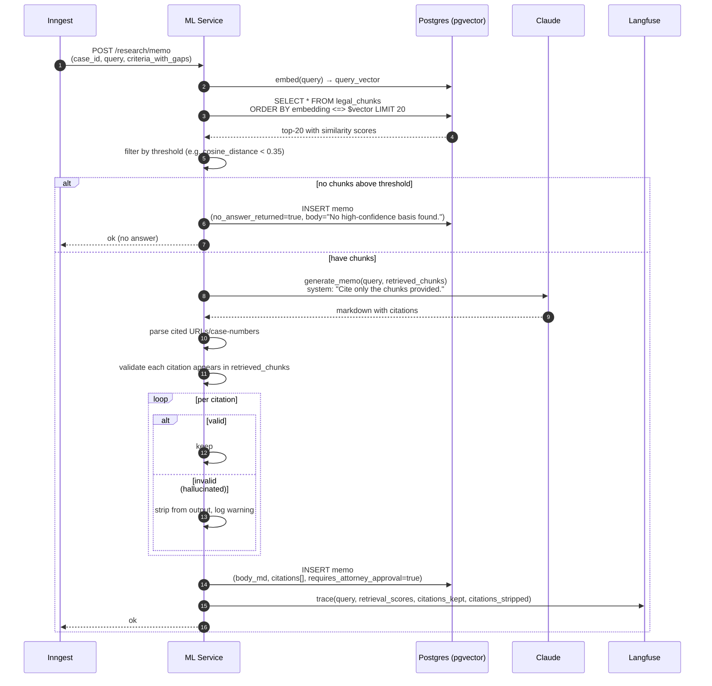
```mermaid
sequenceDiagram
    autonumber
    participant ING as Inngest
    participant ML as ML Service
    participant DB as Postgres (pgvector)
    participant LLM as Claude
    participant LF as Langfuse

    ING->>ML: POST /research/memo<br/>(case_id, query, criteria_with_gaps)
    ML->>DB: embed(query) → query_vector
    ML->>DB: SELECT * FROM legal_chunks<br/>ORDER BY embedding <=> $vector LIMIT 20
    DB-->>ML: top-20 with similarity scores

    ML->>ML: filter by threshold (e.g. cosine_distance < 0.35)
    alt no chunks above threshold
        ML->>DB: INSERT memo<br/>(no_answer_returned=true, body="No high-confidence basis found.")
        ML-->>ING: ok (no answer)
    else have chunks
        ML->>LLM: generate_memo(query, retrieved_chunks)<br/>system: "Cite only the chunks provided."
        LLM-->>ML: markdown with citations

        ML->>ML: parse cited URLs/case-numbers
        ML->>ML: validate each citation appears in retrieved_chunks
        loop per citation
            alt valid
                ML->>ML: keep
            else invalid (hallucinated)
                ML->>ML: strip from output, log warning
            end
        end

        ML->>DB: INSERT memo<br/>(body_md, citations[], requires_attorney_approval=true)
        ML->>LF: trace(query, retrieval_scores, citations_kept, citations_stripped)
        ML-->>ING: ok
    end
```

---

## 9. Forms engine: I-140 auto-fill

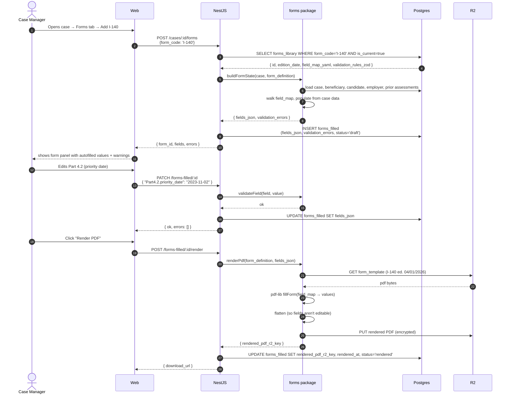
```mermaid
sequenceDiagram
    autonumber
    actor CM as Case Manager
    participant W as Web
    participant API as NestJS
    participant Forms as forms package
    participant DB as Postgres
    participant R2 as R2

    CM->>W: Opens case → Forms tab → Add I-140
    W->>API: POST /cases/:id/forms<br/>{form_code: 'I-140'}
    API->>DB: SELECT forms_library WHERE form_code='I-140' AND is_current=true
    DB-->>API: { id, edition_date, field_map_yaml, validation_rules_zod }
    API->>Forms: buildFormState(case, form_definition)
    Forms->>DB: load case, beneficiary, candidate, employer, prior assessments
    Forms->>Forms: walk field_map, populate from case data
    Forms-->>API: { fields_json, validation_errors }
    API->>DB: INSERT forms_filled<br/>(fields_json, validation_errors, status='draft')
    API-->>W: { form_id, fields, errors }

    W-->>CM: shows form panel with autofilled values + warnings

    CM->>W: Edits Part 4.2 (priority date)
    W->>API: PATCH /forms-filled/:id<br/>{ "Part4.2.priority_date": "2023-11-02" }
    API->>Forms: validateField(field, value)
    Forms-->>API: ok
    API->>DB: UPDATE forms_filled SET fields_json
    API-->>W: { ok, errors: [] }

    CM->>W: Click "Render PDF"
    W->>API: POST /forms-filled/:id/render
    API->>Forms: renderPdf(form_definition, fields_json)
    Forms->>R2: GET form_template (I-140 ed. 04/01/2026)
    R2-->>Forms: pdf bytes
    Forms->>Forms: pdf-lib fillForm(field_map → values)
    Forms->>Forms: flatten (so fields aren't editable)
    Forms->>R2: PUT rendered PDF (encrypted)
    Forms-->>API: { rendered_pdf_r2_key }
    API->>DB: UPDATE forms_filled SET rendered_pdf_r2_key, rendered_at, status='rendered'
    API-->>W: { download_url }
```

---

## 10. Filing packet assembly

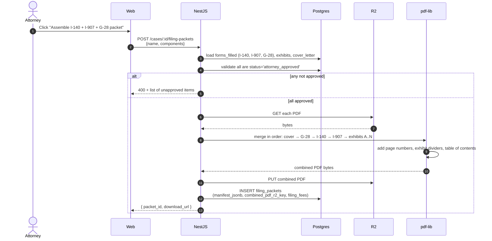
```mermaid
sequenceDiagram
    autonumber
    actor ATY as Attorney
    participant W as Web
    participant API as NestJS
    participant DB as Postgres
    participant R2 as R2
    participant PDF as pdf-lib

    ATY->>W: Click "Assemble I-140 + I-907 + G-28 packet"
    W->>API: POST /cases/:id/filing-packets<br/>{name, components}
    API->>DB: load forms_filled (I-140, I-907, G-28), exhibits, cover_letter
    API->>DB: validate all are status='attorney_approved'
    alt any not approved
        API-->>W: 400 + list of unapproved items
    else all approved
        API->>R2: GET each PDF
        R2-->>API: bytes
        API->>PDF: merge in order: cover → G-28 → I-140 → I-907 → exhibits A..N
        PDF->>PDF: add page numbers, exhibit dividers, table of contents
        PDF-->>API: combined PDF bytes
        API->>R2: PUT combined PDF
        API->>DB: INSERT filing_packets<br/>(manifest_jsonb, combined_pdf_r2_key, filing_fees)
        API-->>W: { packet_id, download_url }
    end
```

---

## 11. Brenda agent tick (autonomous nudge loop)

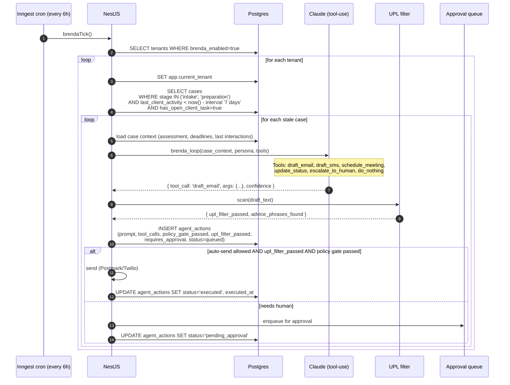
```mermaid
sequenceDiagram
    autonumber
    participant CRON as Inngest cron (every 6h)
    participant API as NestJS
    participant DB as Postgres
    participant LLM as Claude (tool-use)
    participant UPL as UPL filter
    participant Q as Approval queue

    CRON->>API: brendaTick()
    API->>DB: SELECT tenants WHERE brenda_enabled=true
    loop for each tenant
        API->>DB: SET app.current_tenant
        API->>DB: SELECT cases<br/>WHERE stage IN ('intake', 'preparation')<br/>AND last_client_activity < now() - interval '7 days'<br/>AND has_open_client_task=true

        loop for each stale case
            API->>DB: load case context (assessment, deadlines, last interactions)
            API->>LLM: brenda_loop(case_context, persona, tools)
            Note over LLM: Tools: draft_email, draft_sms, schedule_meeting,<br/>update_status, escalate_to_human, do_nothing
            LLM-->>API: { tool_call: 'draft_email', args: {...}, confidence }

            API->>UPL: scan(draft_text)
            UPL-->>API: { upl_filter_passed, advice_phrases_found }

            API->>DB: INSERT agent_actions<br/>(prompt, tool_calls, policy_gate_passed, upl_filter_passed,<br/>requires_approval, status=queued)

            alt auto-send allowed AND upl_filter_passed AND policy gate passed
                API->>API: send (Postmark/Twilio)
                API->>DB: UPDATE agent_actions SET status='executed', executed_at
            else needs human
                API->>Q: enqueue for approval
                API->>DB: UPDATE agent_actions SET status='pending_approval'
            end
        end
    end
```

---

## 12. Outbound email approval gate

The other half of #11 — the human-in-the-loop side.

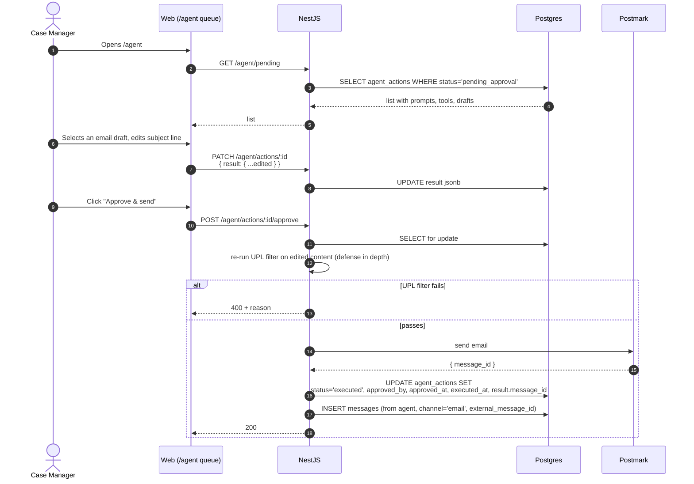
```mermaid
sequenceDiagram
    autonumber
    actor CM as Case Manager
    participant W as Web (/agent queue)
    participant API as NestJS
    participant DB as Postgres
    participant PM as Postmark

    CM->>W: Opens /agent
    W->>API: GET /agent/pending
    API->>DB: SELECT agent_actions WHERE status='pending_approval'
    DB-->>API: list with prompts, tools, drafts
    API-->>W: list

    CM->>W: Selects an email draft, edits subject line
    W->>API: PATCH /agent/actions/:id<br/>{ result: { ...edited } }
    API->>DB: UPDATE result jsonb

    CM->>W: Click "Approve & send"
    W->>API: POST /agent/actions/:id/approve
    API->>DB: SELECT for update
    API->>API: re-run UPL filter on edited content (defense in depth)
    alt UPL filter fails
        API-->>W: 400 + reason
    else passes
        API->>PM: send email
        PM-->>API: { message_id }
        API->>DB: UPDATE agent_actions SET<br/>status='executed', approved_by, approved_at, executed_at, result.message_id
        API->>DB: INSERT messages (from agent, channel='email', external_message_id)
        API-->>W: 200
    end
```

---

## 13. Stripe payment → trust ledger

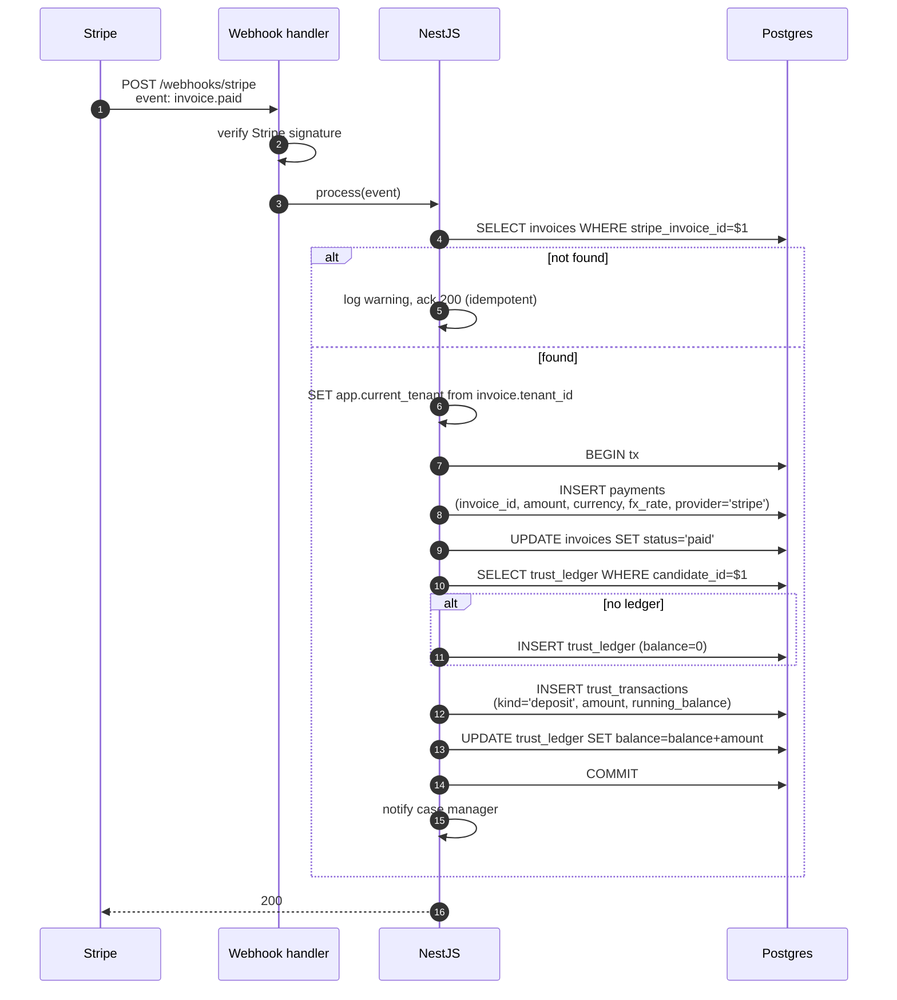
```mermaid
sequenceDiagram
    autonumber
    participant STR as Stripe
    participant WH as Webhook handler
    participant API as NestJS
    participant DB as Postgres

    STR->>WH: POST /webhooks/stripe<br/>event: invoice.paid
    WH->>WH: verify Stripe signature
    WH->>API: process(event)
    API->>DB: SELECT invoices WHERE stripe_invoice_id=$1
    alt not found
        API->>API: log warning, ack 200 (idempotent)
    else found
        API->>API: SET app.current_tenant from invoice.tenant_id
        API->>DB: BEGIN tx
        API->>DB: INSERT payments<br/>(invoice_id, amount, currency, fx_rate, provider='stripe')
        API->>DB: UPDATE invoices SET status='paid'

        API->>DB: SELECT trust_ledger WHERE candidate_id=$1
        alt no ledger
            API->>DB: INSERT trust_ledger (balance=0)
        end
        API->>DB: INSERT trust_transactions<br/>(kind='deposit', amount, running_balance)
        API->>DB: UPDATE trust_ledger SET balance=balance+amount

        API->>DB: COMMIT
        API->>API: notify case manager
    end
    API-->>STR: 200
```

---

## 14. DocuSign envelope → contract signed

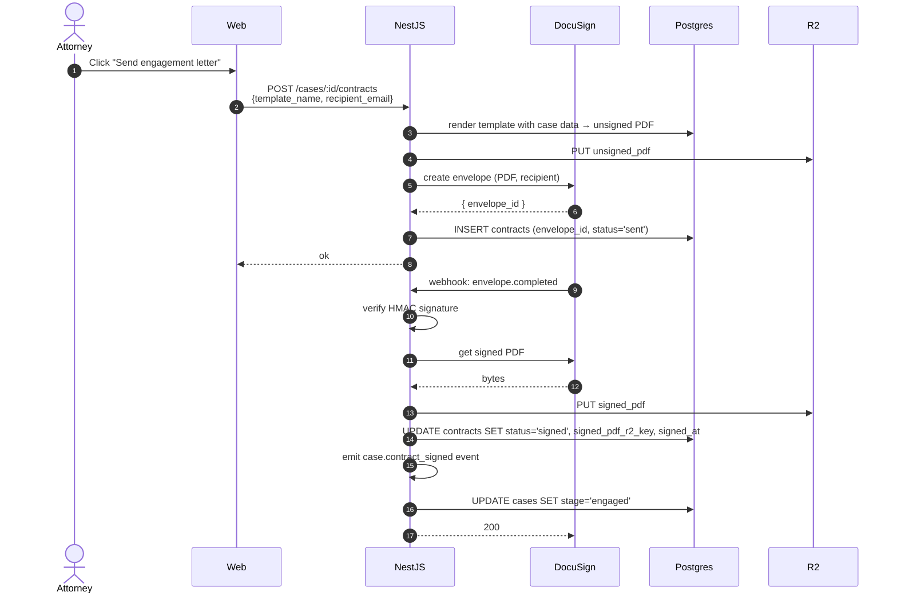
```mermaid
sequenceDiagram
    autonumber
    actor ATY as Attorney
    participant W as Web
    participant API as NestJS
    participant DS as DocuSign
    participant DB as Postgres
    participant R2 as R2

    ATY->>W: Click "Send engagement letter"
    W->>API: POST /cases/:id/contracts<br/>{template_name, recipient_email}
    API->>DB: render template with case data → unsigned PDF
    API->>R2: PUT unsigned_pdf
    API->>DS: create envelope (PDF, recipient)
    DS-->>API: { envelope_id }
    API->>DB: INSERT contracts (envelope_id, status='sent')
    API-->>W: ok

    DS->>API: webhook: envelope.completed
    API->>API: verify HMAC signature
    API->>DS: get signed PDF
    DS-->>API: bytes
    API->>R2: PUT signed_pdf
    API->>DB: UPDATE contracts SET status='signed', signed_pdf_r2_key, signed_at
    API->>API: emit case.contract_signed event
    API->>DB: UPDATE cases SET stage='engaged'
    API-->>DS: 200
```

---

## 15. Postmark inbound email → case thread

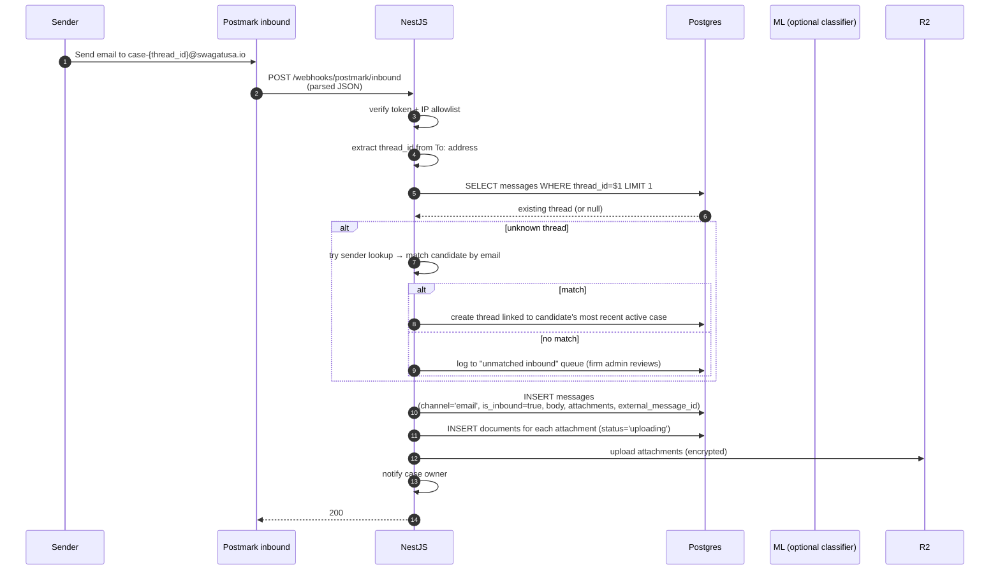
```mermaid
sequenceDiagram
    autonumber
    participant Sender
    participant PM as Postmark inbound
    participant API as NestJS
    participant DB as Postgres
    participant ML as ML (optional classifier)

    Sender->>PM: Send email to case-{thread_id}@swagatusa.io
    PM->>API: POST /webhooks/postmark/inbound<br/>(parsed JSON)
    API->>API: verify token + IP allowlist
    API->>API: extract thread_id from To: address
    API->>DB: SELECT messages WHERE thread_id=$1 LIMIT 1
    DB-->>API: existing thread (or null)

    alt unknown thread
        API->>API: try sender lookup → match candidate by email
        alt match
            API->>DB: create thread linked to candidate's most recent active case
        else no match
            API->>DB: log to "unmatched inbound" queue (firm admin reviews)
        end
    end

    API->>DB: INSERT messages<br/>(channel='email', is_inbound=true, body, attachments, external_message_id)
    API->>DB: INSERT documents for each attachment (status='uploading')
    API->>R2: upload attachments (encrypted)
    API->>API: notify case owner
    API-->>PM: 200
```

---

## 16. USCIS receipt poll cron

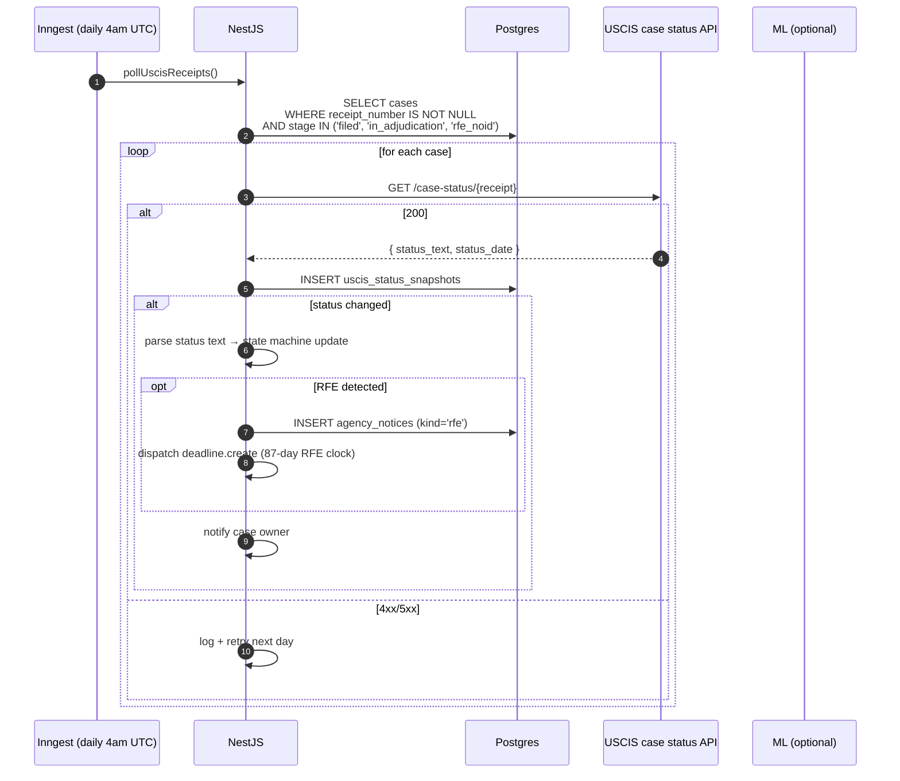
```mermaid
sequenceDiagram
    autonumber
    participant CRON as Inngest (daily 4am UTC)
    participant API as NestJS
    participant DB as Postgres
    participant USCIS as USCIS case status API
    participant ML as ML (optional)

    CRON->>API: pollUscisReceipts()
    API->>DB: SELECT cases<br/>WHERE receipt_number IS NOT NULL<br/>AND stage IN ('filed', 'in_adjudication', 'rfe_noid')
    loop for each case
        API->>USCIS: GET /case-status/{receipt}
        alt 200
            USCIS-->>API: { status_text, status_date }
            API->>DB: INSERT uscis_status_snapshots
            alt status changed
                API->>API: parse status text → state machine update
                opt RFE detected
                    API->>DB: INSERT agency_notices (kind='rfe')
                    API->>API: dispatch deadline.create (87-day RFE clock)
                end
                API->>API: notify case owner
            end
        else 4xx/5xx
            API->>API: log + retry next day
        end
    end
```

---

## 17. Visa Bulletin daily scrape

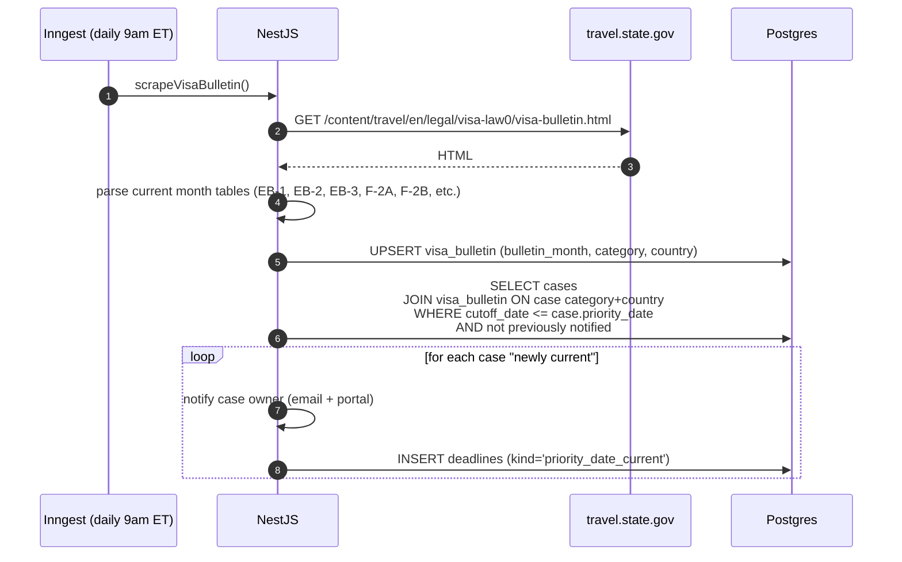
```mermaid
sequenceDiagram
    autonumber
    participant CRON as Inngest (daily 9am ET)
    participant API as NestJS
    participant DOS as travel.state.gov
    participant DB as Postgres

    CRON->>API: scrapeVisaBulletin()
    API->>DOS: GET /content/travel/en/legal/visa-law0/visa-bulletin.html
    DOS-->>API: HTML
    API->>API: parse current month tables (EB-1, EB-2, EB-3, F-2A, F-2B, etc.)
    API->>DB: UPSERT visa_bulletin (bulletin_month, category, country)

    API->>DB: SELECT cases<br/>JOIN visa_bulletin ON case category+country<br/>WHERE cutoff_date <= case.priority_date<br/>AND not previously notified
    loop for each case "newly current"
        API->>API: notify case owner (email + portal)
        API->>DB: INSERT deadlines (kind='priority_date_current')
    end
```

---

## 18. RFE notice upload → deadline auto-creation

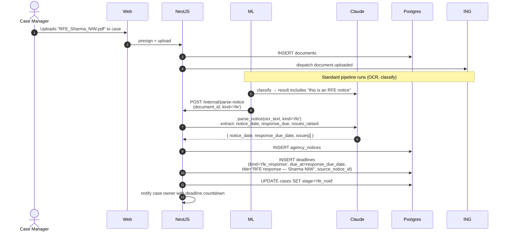
```mermaid
sequenceDiagram
    autonumber
    actor CM as Case Manager
    participant W as Web
    participant API as NestJS
    participant ML as ML
    participant LLM as Claude
    participant DB as Postgres

    CM->>W: Uploads "RFE_Sharma_NIW.pdf" to case
    W->>API: presign + upload
    API->>DB: INSERT documents
    API->>ING: dispatch document.uploaded

    Note over ING,ML: Standard pipeline runs (OCR, classify)
    ML->>LLM: classify → result includes "this is an RFE notice"
    ML->>API: POST /internal/parse-notice<br/>(document_id, kind='rfe')

    API->>LLM: parse_notice(ocr_text, kind='rfe')<br/>extract: notice_date, response_due, issues_raised
    LLM-->>API: { notice_date, response_due_date, issues[] }
    API->>DB: INSERT agency_notices
    API->>DB: INSERT deadlines<br/>(kind='rfe_response', due_at=response_due_date,<br/>title="RFE response — Sharma NIW", source_notice_id)
    API->>DB: UPDATE cases SET stage='rfe_noid'
    API->>API: notify case owner with deadline countdown
```

---

## 19. Cross-tenant isolation test (CI)

The test that runs on every PR. If this fails, no merge.

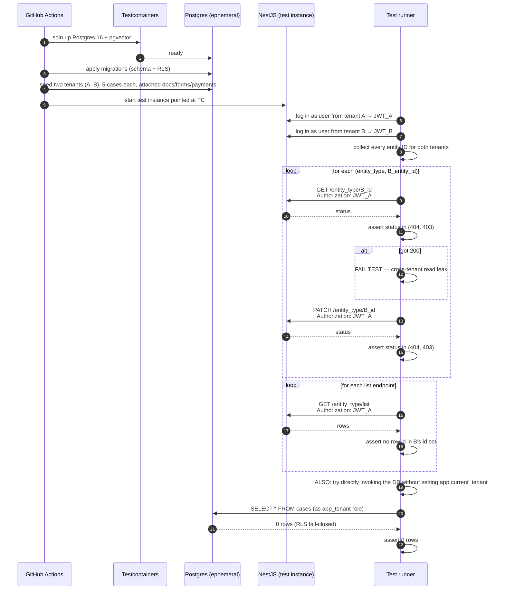
```mermaid
sequenceDiagram
    autonumber
    participant CI as GitHub Actions
    participant TC as Testcontainers
    participant DB as Postgres (ephemeral)
    participant API as NestJS (test instance)
    participant T as Test runner

    CI->>TC: spin up Postgres 16 + pgvector
    TC->>DB: ready
    CI->>DB: apply migrations (schema + RLS)
    CI->>DB: seed two tenants (A, B), 5 cases each, attached docs/forms/payments
    CI->>API: start test instance pointed at TC

    T->>API: log in as user from tenant A → JWT_A
    T->>API: log in as user from tenant B → JWT_B
    T->>T: collect every entity ID for both tenants

    loop for each (entity_type, B_entity_id)
        T->>API: GET /entity_type/B_id<br/>Authorization: JWT_A
        API-->>T: status
        T->>T: assert status in (404, 403)
        alt got 200
            T->>T: FAIL TEST — cross-tenant read leak
        end

        T->>API: PATCH /entity_type/B_id<br/>Authorization: JWT_A
        API-->>T: status
        T->>T: assert status in (404, 403)
    end

    loop for each list endpoint
        T->>API: GET /entity_type/list<br/>Authorization: JWT_A
        API-->>T: rows
        T->>T: assert no row.id in B's id set
    end

    T->>T: ALSO: try directly invoking the DB without setting app.current_tenant
    T->>DB: SELECT * FROM cases (as app_tenant role)
    DB-->>T: 0 rows (RLS fail-closed)
    T->>T: assert 0 rows
```

---

## 20. Right-to-erasure

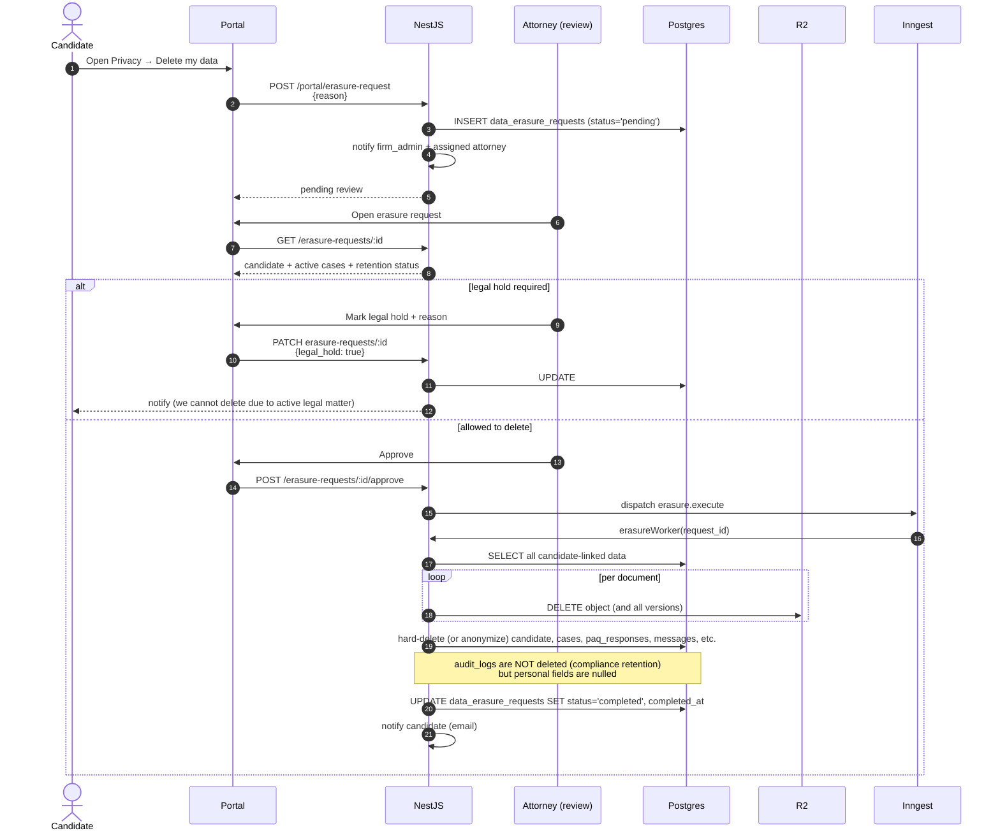
```mermaid
sequenceDiagram
    autonumber
    actor C as Candidate
    participant W as Portal
    participant API as NestJS
    participant ATY as Attorney (review)
    participant DB as Postgres
    participant R2 as R2
    participant ING as Inngest

    C->>W: Open Privacy → Delete my data
    W->>API: POST /portal/erasure-request<br/>{reason}
    API->>DB: INSERT data_erasure_requests (status='pending')
    API->>API: notify firm_admin + assigned attorney
    API-->>W: pending review

    ATY->>W: Open erasure request
    W->>API: GET /erasure-requests/:id
    API-->>W: candidate + active cases + retention status

    alt legal hold required
        ATY->>W: Mark legal hold + reason
        W->>API: PATCH erasure-requests/:id<br/>{legal_hold: true}
        API->>DB: UPDATE
        API-->>C: notify (we cannot delete due to active legal matter)
    else allowed to delete
        ATY->>W: Approve
        W->>API: POST /erasure-requests/:id/approve
        API->>ING: dispatch erasure.execute
        ING->>API: erasureWorker(request_id)
        API->>DB: SELECT all candidate-linked data
        loop per document
            API->>R2: DELETE object (and all versions)
        end
        API->>DB: hard-delete (or anonymize) candidate, cases, paq_responses, messages, etc.
        Note over API,DB: audit_logs are NOT deleted (compliance retention)<br/>but personal fields are nulled
        API->>DB: UPDATE data_erasure_requests SET status='completed', completed_at
        API->>API: notify candidate (email)
    end
```

---

## TODO sequence diagrams

These flows exist in the architecture but don't have diagrams yet:

- Re-keying a tenant's KMS data key (key rotation)
- Migrating a tenant from row-level to schema-per-tenant (when an enterprise customer demands it)
- Multi-region failover (Phase 14+)
- Bulk import from Clio / MyCase / Docketwise (sales accelerator)
- Brenda eval harness run on prompt change
